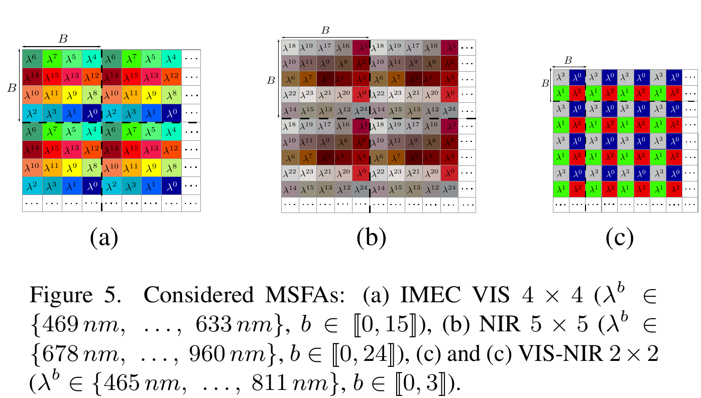

Code implementation of "Learning deep illumination-robust features from multispectral filter array 
images" from WACV 2025

Overview
Abstract
	Multispectral (MS) snapshot cameras equipped with a MS filter array (MSFA), capture multiple spectral bands in a single shot, resulting in a raw mosaic image where each pixel holds only one channel value. The fully-defined MS image is estimated from the raw one through *demosaicing*, 
which inevitably introduces spatio-spectral artifacts. Moreover, training on fully-defined MS images can be computationally 
intensive, particularly with deep neural networks (DNNs), and may result in features lacking discrimination power due 
to suboptimal learning of spatio-spectral interactions. Furthermore, outdoor MS image acquisition occurs under varying 
lighting conditions, leading to illumination-dependent features. This paper presents an original approach to learn 
discriminant and illumination-robust features directly from raw images. It involves: *raw spectral constancy* 
to mitigate the impact of illumination, *MSFA-preserving* transformations suited for raw image augmentation to 
train DNNs on diverse raw textures, and *raw-mixing* to capture discriminant spatio-spectral interactions in raw images. 
		Experiments on MS image classification show that our approach outperforms both handcrafted and recent deep learning-based methods, while also requiring significantly less computational effort. The source code is available at https://github.com/AnisAmziane/RawTexture.

## Data preparation
Our work uses the public [HyTexila](https://color.univ-lille.fr/datasets/hytexila) and [SpecTex](https://sites.uef.fi/spectral/databases-software/spectex-hyperspectral-texture-image-database/) 
datasets to simulate raw images acquired by three different snapshot cameras: IMEC 5x5, IMEC 4x4, and IMEC 2x2.

After downloading the datasets, use the codes provided in the "dataset" folder to simulate raw 
radiance images

Dataset folder:

<pre lang="none" class="notranslate"><code>
├── HyTexila2A/HyTexila2D65/HyTexila2Solar: Convert HyTexila reflectance images to radiance images
├── SpecTex2A/SpecTex2D65/SpecTex2Solar: Convert HyTexila SpecTex images to radiance images
├── make_MS_base:
├── make_raw_base:
</code></pre>

## Model structure

RawMixer architecture exploits spatio-spectral feature mixing and attention to learn discriminant 
features directly from raw images.

### Cite

